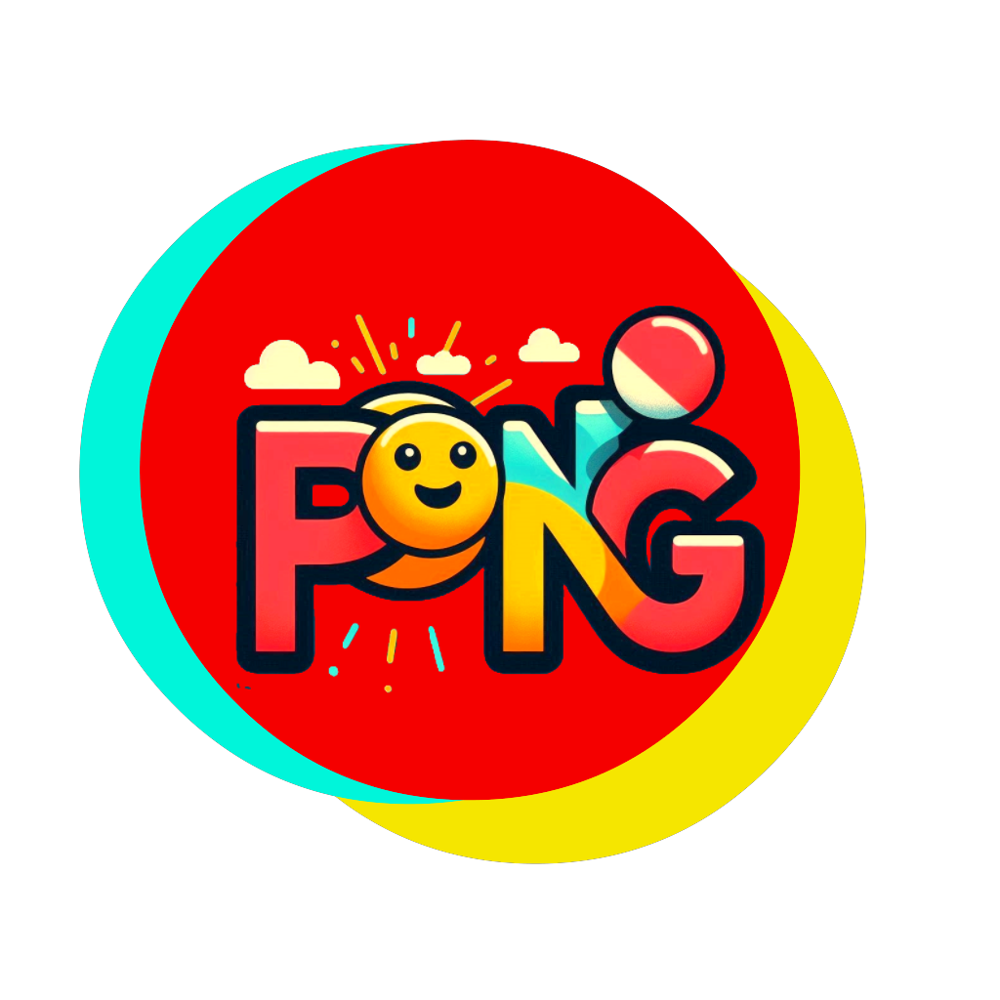

# 🎮 Pong Game
<p align="center">
    
</p>

## 📖 Overview

Welcome to the classic Pong game, recreated in Unity using C#. This project features:
- A player-controlled paddle
- An AI-controlled paddle
- A ball that bounces around the screen

The objective is simple: score points by getting the ball past the opponent's paddle. This project is designed for learning and showcasing my portfolio.

## 🕹️ Gameplay

- **Player Paddle**: Controlled using the 'W' and 'S' keys or the Up and Down arrow keys.
- **AI Paddle**: Automatically follows the ball's vertical position.
- **Scoring**: Score points when the ball passes the opponent's paddle.
- **Winning**: First to reach 7 points wins the game, and the game resets.

## 🎛️ Controls

- `W` or `Up Arrow`: Move the player paddle up.
- `S` or `Down Arrow`: Move the player paddle down.

## 🛠️ Installation and Setup

1. **Clone the repository** or download the project files.
2. **Open Unity Hub** and click on `Add`.
3. **Navigate** to the folder where you cloned or extracted the project and open it.
4. **Open the Scene**: Go to `Assets/Scenes` and open the `MainScene`.
5. **Play the Game**: Click on the `Play` button at the top of the Unity editor to start the game.

## 📂 Project Structure

```
Pong Game
├── Assets
│ ├── Scripts
│ │ ├── EnemyController.cs
│ │ ├── PlayerController.cs
│ │ ├── Ball.cs
│ │ └── GameManager.cs
│ ├── Scenes
│ │ └── MainScene.unity
│ └── Prefabs
│ ├── PlayerPaddle.prefab
│ ├── EnemyPaddle.prefab
│ └── Ball.prefab
```

- **Scripts**
  - `EnemyController.cs`: Controls the AI paddle.
  - `PlayerController.cs`: Handles player input for the paddle.
  - `Ball.cs`: Manages ball behavior and collisions.
  - `GameManager.cs`: Manages game states, scoring, and win conditions.
- **Scenes**
  - `MainScene.unity`: The main scene where the game takes place.
- **Prefabs**
  - Contains prefabs for paddles and ball.

## 📝 Scripts Overview

### `EnemyController.cs`

Controls the enemy paddle to follow the ball's vertical position within limits.

### `PlayerController.cs`

Handles player input for moving the paddle up and down.

### `Ball.cs`

Manages the ball's movement, collisions with paddles and walls, and resets after scoring.

### `GameManager.cs`

Initializes the game, tracks scores, checks win conditions, and resets the game when a player wins.

## 🌟 Additional Features

- **Increasing Difficulty**: The ball's speed increases slightly with each paddle collision.
- **Automatic Reset**: The game resets automatically when a player reaches the winning score.

## 🚀 Future Enhancements

- Add sound effects for paddle hits and scoring.
- Implement different difficulty levels for the AI.
- Add a main menu and a game over screen.
- Improve the visual design of the game.
- Implement multiplayer support.

## 🙏 Credits

This game was developed as a learning project by **Michael**. Thx to the Unity community for their resources and Thx EBAC.

## 📜 License

This project is licensed under the MIT License - see the LICENSE file for details.

---

Enjoy the game and have fun!
